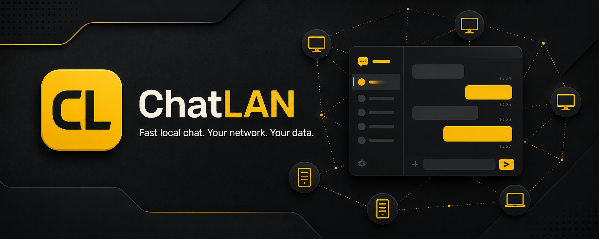

# ChatLAN



ChatLAN is a friendly Windows desktop chat application for people connected to the same local network. It automatically discovers nearby ChatLAN users, allows direct messaging and supports local file transfers without requiring a central chat account.

> This public repository contains official Windows installers and update metadata only. The ChatLAN application source code is maintained in a separate private repository. GitHub's automatically generated **Source code (zip/tar.gz)** files contain only this release repository's README and do not contain the private application source.

## Download

Download the latest version from the [ChatLAN Releases page](https://github.com/azli86/ChatLAN-Releases/releases/latest).

Current release: **ChatLAN 2.17.1 for Windows x64**

- [Download ChatLAN Setup 2.17.1](https://github.com/azli86/ChatLAN-Releases/releases/download/v2.17.1/ChatLAN.Setup.2.17.1.exe)
- [Download SHA-256 checksum](https://github.com/azli86/ChatLAN-Releases/releases/download/v2.17.1/ChatLAN.Setup.2.17.1.exe.sha256)
- SHA-256: `bb4fb50db5be8ee2daeedc614d00643429ea5061b9f9574b0a546593443ebdf7`

## Main features

- Automatic discovery of ChatLAN users on the same LAN/Wi-Fi network
- Direct local-network messaging and locally stored chat history
- Persistent conversation list: previous chats remain readable when contacts are offline
- Offline text-message queue with automatic delivery when a previous contact returns online
- Local contact deletion with persistent hiding and safe restoration on a new incoming message
- User and Windows PC details retained in chat history for reliable offline conversations
- Account identity includes department, job title, friendly device label, Windows user and PC/platform details
- Delete individual messages or complete history locally, with two-way deletion while both users are online
- File transfer with recipient acceptance, sender cancellation and transfer progress
- Drag-and-drop attachments and inline preview for supported images/media
- Automatic PDF cards, an integrated PDF viewer/editor and the ability to send an edited PDF back to the same user
- User profile picture, availability status and user information
- Emoji picker, message search and chat-history backup
- Light, dark and multiple colour themes, including Batman, Windows and Apple-inspired themes
- Mini Chat and privacy features for quickly reducing visible conversation content
- System tray support, new-message notifications and optional online/offline notifications
- Optional start with Windows and single-instance protection
- Configurable attachment storage folder
- Optional application PIN
- Optional universal external JSON API configuration using a user-supplied base URL
- Built-in update checking through official GitHub Releases
- Visible update download progress with percentage, MB count, verification status and retry

## System requirements

- Windows 10 or Windows 11, 64-bit
- PCs must be connected to the same trusted LAN or Wi-Fi network for local discovery and chat
- Windows Firewall permission may be required when ChatLAN runs for the first time
- No Node.js installation is required; the installer contains the Windows application runtime

## Installation

1. Download the `.exe` installer from the latest release.
2. Open the installer and follow the setup instructions.
3. Allow ChatLAN through Windows Firewall on **Private networks** when prompted.
4. Install and open ChatLAN on another PC connected to the same LAN/Wi-Fi to begin chatting.

The installer is not currently signed with a commercial code-signing certificate. Windows SmartScreen may therefore display an **Unknown publisher** warning. Only download ChatLAN from this official repository and verify the SHA-256 checksum when required.

## Updates

ChatLAN checks this repository for newer releases. When an update is found, it can show an in-app update dialog and a Windows tray notification. The downloaded installer is verified against its published SHA-256 checksum before it is launched.

## Privacy and network safety

- Chat messages and settings are stored locally on each Windows PC.
- Ordinary LAN chat does not require a cloud account or public internet server.
- Configuring an external API provider may send selected data outside the LAN according to that provider's service and privacy policy.
- Use ChatLAN only on a trusted home or workplace network.
- Do not expose ChatLAN ports directly to the internet or configure router port forwarding for ChatLAN.
- ChatLAN LAN traffic should not currently be treated as end-to-end encrypted. Do not use it for highly confidential information until independent security review and transport encryption are completed.
- The application PIN helps prevent casual access to the user interface; it is not full disk or database encryption.

Formatting or reinstalling Windows can remove locally stored chat data. Create chat-history backups and keep important files in a safe location.

## Verify the installer

In PowerShell, run:

```powershell
Get-FileHash -Algorithm SHA256 ".\ChatLAN.Setup.2.17.1.exe"
```

Expected SHA-256 for ChatLAN 2.14.0:

```text
341c67e38d6c83846fcae87cd90287526c27683254a4ebaf1b712282a1eacbd8
```

## Support and testing

For reliable testing, install the same ChatLAN version on two Windows PCs connected to the same network. If users are not discovered, confirm both PCs are using a Private network profile and that Windows Firewall allows ChatLAN.

When reporting a problem, include the ChatLAN version, Windows version, the action that caused the problem and a screenshot where possible. Do not publish API keys, private messages, PINs, local database files or other sensitive information.

## Release repository

This repository is intentionally public so ChatLAN users and the built-in updater can download official installers. It does not provide a licence to redistribute, reverse engineer or claim ownership of the application.

Copyright © 2026 ChatLAN. All rights reserved.
